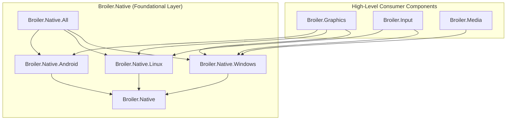

# Developer and Contributor Guide

This document details the architectural conventions, development setup, coding guidelines, testing strategies, and release workflows for contributors and maintainers of `Broiler.Native`.

---

## 1. Architecture and Scope

The architecture of `Broiler.Native` is governed by [ADR 0001: Native API ownership and dependency direction](adr/0001-native-api-ownership.md).

### The Inverted Native Boundary

Historically, native declarations were scattered across domain libraries (`Broiler.Graphics`, `Broiler.Input`, `Broiler.Media`). `Broiler.Native` unifies these low-level bindings into a dedicated, foundational layer.



### Scope Rules

- **What belongs in `Broiler.Native`:**
  - P/Invoke declarations (`[LibraryImport]` and `[DllImport]`).
  - Source-generated COM interfaces (`[GeneratedComInterface]`).
  - Unmanaged ABI structs and unions (`[StructLayout]`).
  - Native constants, flags, enum values, and COM interface GUIDs.
  - Thin, platform-specific native exception types (e.g. `LinuxOpenGlException`, `LinuxVulkanException`).
  - Low-level lifetime helpers (`ComPtr<T>`, `NativeLibraryProbe`).
  - Assembly-scoped dynamic library resolvers (`AndroidNativeLibraries`).

- **What does NOT belong in `Broiler.Native`:**
  - High-level rendering, scene graphs, or device managers.
  - Input gesture recognition, polling background loops, or event routers.
  - Media decoding pipelines, audio processing graphs, or format converters.
  - Domain error translations (e.g., mapping `HRESULT` to custom high-level domain exceptions).
  - External third-party NuGet dependencies.

---

## 2. Environment Setup

### Required Tools

- **.NET 10 SDK** (v10.0.x or newer): Core compiler, MSBuild, and runtime.
- **Node.js 24**: Required for running the preview version resolution scripts.
- **PowerShell 7** or **Windows PowerShell 5.1**: Required for packaging and feed verification scripts.
- **Bash** (Linux) or **Git Bash** (Windows): Required for running shell test runners.

Verify your local environment:
```sh
dotnet --version
node --version
pwsh --version  # or powershell -Command "$PSVersionTable.PSVersion"
```

---

## 3. Building and Testing

### Solution Structure

The project uses the modern solution format `Broiler.Native.slnx`:

- `src/Broiler.Native/`: Core library probing (`NativeLibraryProbe`).
- `src/Broiler.Native.Windows/`: Windows Win32, DirectX, WIC, WASAPI, Media Foundation.
- `src/Broiler.Native.Linux/`: Linux libc/evdev, X11, OpenGL, Vulkan.
- `src/Broiler.Native.Android/`: Android EGL, GLES, ANativeWindow, dynamic resolver.
- `src/Broiler.Native.All/`: Meta-package referencing all native platforms.
- `src/tests/Broiler.Native.Tests/`: Self-contained console test harness.

### Build Commands

Build the solution in `Release` configuration:

```sh
dotnet build Broiler.Native.slnx -c Release
```

For debugging native structures and symbols, use `Debug`:

```sh
dotnet build Broiler.Native.slnx -c Debug
```

### Running Tests

The test suite runs as a console runner following the Broiler platform conventions:

```sh
# Run via dotnet directly:
dotnet run --project src/tests/Broiler.Native.Tests -c Release --no-build

# Or via the cross-platform shell script:
bash ./eng/run-tests.sh Release
```

The test runner asserts:
1. **COM Interface Uniqueness**: Every COM GUID has exactly one public contract.
2. **Single Import Ownership**: Shared Windows entry points (e.g., `CoInitializeEx`, `MFStartup`) are imported by exactly one class.
3. **ABI Layout Integrity**: Unmanaged struct byte sizes match native headers exactly.
4. **Dependency Cleanliness**: No native assembly references any non-Native Broiler components.
5. **NativeAOT Compatibility**: COM interfaces and streaming operate cleanly under NativeAOT without relying on legacy runtime marshalling.
6. **Probe Resilience**: Dynamic library probes report missing libraries cleanly without throwing.

### Testing Version Resolution Scripts

Run the Node.js test suite for the preview version resolution engine:

```sh
node --test eng/resolve-preview-version.test.mjs
```

---

## 4. Authoring Guidelines for Native Bindings

### 1. Modern P/Invoke with `[LibraryImport]`

Where possible, prefer the source-generated `[LibraryImport]` attribute over `[DllImport]`:

```csharp
[LibraryImport("kernel32.dll", SetLastError = true, StringMarshalling = StringMarshalling.Utf16, EntryPoint = "GetModuleHandleW")]
public static partial IntPtr GetModuleHandle(string? moduleName);
```

- Always mark the enclosing class and method `partial`.
- Explicitly set `StringMarshalling = StringMarshalling.Utf16` for Unicode Win32 APIs, or use `[MarshalAs(UnmanagedType.LPUTF8Str)]` for POSIX/Linux entry points.
- Use explicit `EntryPoint` names (e.g. `CreateWindowExW`) to avoid runtime resolution ambiguities.

### 2. COM Interfaces under NativeAOT

To ensure 100% NativeAOT compatibility, use .NET's compile-time COM source generator:

```csharp
[GeneratedComInterface]
[Guid("0000000c-0000-0000-C000-000000000046")]
[InterfaceType(ComInterfaceType.InterfaceIsIUnknown)]
public partial interface IStream
{
    [PreserveSig]
    int Read(IntPtr pv, uint cb, out uint pcbRead);

    [PreserveSig]
    int Write(IntPtr pv, uint cb, out uint pcbWritten);
}
```

- Annotate with `[GeneratedComInterface]`.
- Always declare `[PreserveSig]` on methods returning `HRESULT` (`int`), so the native status code is preserved.
- Allocate and release COM objects using `ComNative.CoCreateInstance`, `ComNative.GetOrCreateComObject<T>`, and `ComNative.ReleaseComObject`.
- Never use legacy built-in COM marshallers (`Marshal.GetObjectForIUnknown`) which throw `NotSupportedException` under NativeAOT.

### 3. Struct Layout and ABI Sizing

Every struct passed across the native boundary must have deterministic memory layout:

```csharp
[StructLayout(LayoutKind.Sequential)]
public readonly struct RECT(int left, int top, int right, int bottom)
{
    public readonly int Left = left;
    public readonly int Top = top;
    public readonly int Right = right;
    public readonly int Bottom = bottom;
}
```

Whenever adding a new unmanaged struct, add an ABI size check to `src/tests/Broiler.Native.Tests/Program.cs`:

```csharp
Size<WindowNative.RECT>(16);
```

### 4. Thin Exceptions

Native bindings should not invent domain error hierarchies. Keep exceptions minimal and attached directly to the native subsystem:

```csharp
public sealed class LinuxOpenGlException(int errorCode, string message) : Exception(message)
{
    public int ErrorCode { get; } = errorCode;
}
```

---

## 5. Packaging and Local Verification

### Packaging Locally

Run `eng/pack.ps1` to produce shipping NuGet packages and symbol packages:

```sh
pwsh -File eng/pack.ps1 -Configuration Release
```

`pack.ps1` validates the output artifacts:
- Confirms all 5 packages share the same package version.
- Verifies embedded package metadata (`README.md`, `icon.png`, license expression).
- Asserts inclusion of XML API documentation and source link symbol archives (`.snupkg`).
- Verifies exact version matching across inter-package dependencies.

### Verifying Consumer Restore

Run `eng/verify-feed.ps1` to prove that a downstream consumer can restore the generated packages using only NuGet.org:

```sh
pwsh -File eng/verify-feed.ps1 -Packages artifacts
```

This script:
1. Generates a temporary consumer project and an isolated `NuGet.config`.
2. Restores packages against the local artifacts directory and `https://api.nuget.org/v3/index.json`.
3. Verifies that no private or missing dependencies block clean restoration.

---

## 6. CI/CD and Publishing to NuGet.org

The repository uses GitHub Actions for continuous integration and publishing exclusively to [NuGet.org](https://www.nuget.org).

### Continuous Integration (`ci.yml`)

- Runs on every push to `main` and on pull requests.
- Matrix builds across `ubuntu-latest` and `windows-latest`.
- Runs unit tests and version resolution tests.
- Windows runner packs and validates all 5 packages, uploading them as the `nuget-packages` artifact.

### Publishing (`publish.yml`)

The publishing workflow is fully automated and targets NuGet.org:

1. **Version Resolution**:
   - Invokes `eng/resolve-preview-version.mjs`.
   - Queries the NuGet.org flat container index (`https://api.nuget.org/v3/flatcontainer/{id}/index.json`) for all published versions of `Broiler.Native.*`.
   - Computes the next sequential `X.Y.Z-preview.N` version.
2. **Package Validation**:
   - Calls `ci.yml` with the resolved version to build, test, and pack validated `.nupkg` and `.snupkg` artifacts.
3. **Consumer Verification**:
   - Executes `eng/verify-feed.ps1` in an isolated environment against NuGet.org.
4. **Push**:
   - Pushes packages and symbol packages to NuGet.org using the `NUGET_API_KEY` repository secret.

#### Triggering a Release

- **Manual Workflow Dispatch**:
  - In the GitHub Actions UI, navigate to **Publish** and click **Run workflow**.
  - Set `dry-run: true` to test the entire process (version selection, pack, verification) without pushing to NuGet.org.
  - Set `dry-run: false` to publish live.
  - Optionally provide `version-suffix` to specify a manual preview identifier.
- **Git Tag**:
  - Pushing a tag formatted as `vX.Y.Z-preview.N` automatically executes a live release to NuGet.org with `dry-run: false`.
